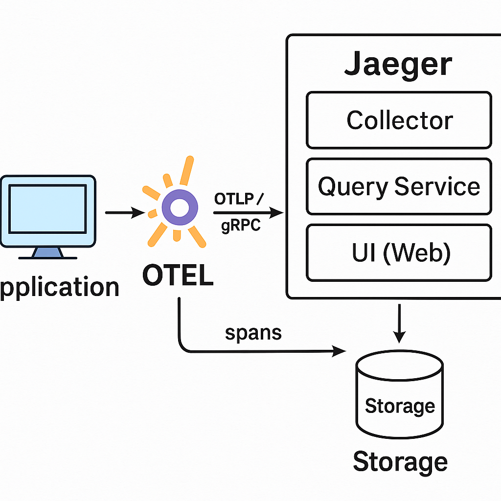
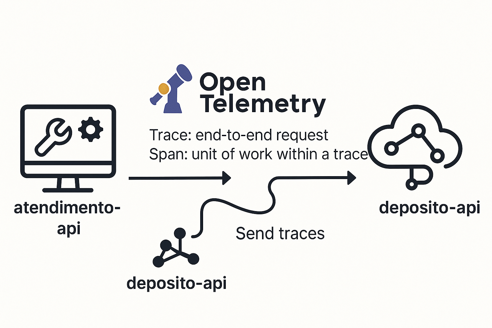

# 📦 Sistema de Pedidos com Observabilidade Distribuída (OpenTelemetry + Jaeger)


Este repositório contém um sistema composto por dois serviços desenvolvidos com **.NET 8** utilizando **Arquitetura Limpa**, e observabilidade distribuída com **OpenTelemetry** e **Jaeger**.


---

## 📚 Sumário

- [Contexto](#-contexto)
- [Arquitetura](#%EF%B8%8F-arquitetura)
- [Tecnologias Utilizadas](#%EF%B8%8F-tecnologias-utilizadas)
- [Executando o Projeto](#-executando-o-projeto)
- [Ambiente de Desenvolvimento Local](#-ambiente-de-desenvolvimento-local)
- [Ambiente com Docker](#-ambiente-com-docker)
- [Observabilidade com OpenTelemetry](#--observabilidade-com-opentelemetry--jaeger)
- [Comandos Úteis](#-comandos-úteis)
- [Licença](#-licença)

---

## 📘 Contexto

O sistema é formado por dois serviços independentes:

- **Deposito**: Gerencia o estoque e os produtos.
- **Atendimento**: Realiza pedidos e consulta os produtos no serviço do depósito.

Durante a palestra, você verá como:

- Serviços independentes se comunicam via HTTP.
- OpenTelemetry coleta e envia traces distribuídos para o Jaeger.
- Identificar gargalos e falhas através do tracing distribuído.

---

## 🏗️ Arquitetura

Ambos os serviços seguem a **Arquitetura Limpa**:

Cada projeto está separado por responsabilidade: Domínio, Aplicação, Infraestrutura e Interface de Entrada (API).

---

## 🛠️ Tecnologias Utilizadas

- [.NET 8](https://dotnet.microsoft.com/)
- **Entity Framework Core 9**
- **PostgreSQL**
- **OpenTelemetry**
- **Jaeger**
- **Docker**
- **Arquitetura Limpa**

---

## ✅ Ambiente de Desenvolvimento Local
Antes de aplicar migrations ou rodar o projeto, certifique-se de que o ambiente está preparado:

✅ 1. .NET SDK instalado  
Você precisa do .NET SDK 8.0 (ou a versão utilizada no projeto).  
Verifique com:

```bash
dotnet --version
```
Se não tiver o SDK, instale do site oficial:
👉 https://dotnet.microsoft.com/en-us/download

2. Ferramenta Entity Framework CLI instalada
Execute este comando para instalar o pacote globalmente:
```bash
dotnet tool install --global dotnet-ef
```
Confirme a instalação com:

```bash
dotnet ef --version
```
✅ 3. Projeto deve compilar corretamente
Verifique que ambos os serviços compilam:

```bash
dotnet build Atendimento/Atendimento.API/Atendimento.API.csproj
```
```bash
dotnet build Deposito/Deposito.API/Deposito.API.csproj
```

---

## 🚀 Executando o Projeto

1. **Clone o repositório**
   ```bash
   git clone https://github.com/brendofreitas/ProjetoTracingDistribuidoMicroServicos.git

2. **Subir o ambiente com Docker**
   ```bash
   docker-compose up -d
3. **Execute as migrations para os serviços**
##### Para o serviço Deposito
```bash
   dotnet ef database update --project Deposito/Deposito.API/Deposito.API.csproj --startup-project Deposito/Deposito.API/Deposito.API.csproj
```
##### Para o serviço Atendimento
```bash
   dotnet ef database update --project Atendimento/Atendimento.API/Atendimento.API.csproj --startup-project Atendimento/Atendimento.API/Atendimento.API.csproj
```  

4. **Acesse os serviços**
- **Atendimento**: [http://localhost:5000](http://localhost:5000)
- **Deposito**: [http://localhost:5001](http://localhost:5001)
- **Jaeger UI**: [http://localhost:16686](http://localhost:16686)

---
## 🐳 Ambiente com Docker

Este projeto utiliza Docker para orquestrar todos os serviços necessários em containers isolados, garantindo consistência e facilidade de execução.

- O que é utilizado no docker-compose.yml:
- **Jaeger**: Container com o Jaeger All-in-One para visualização de traces distribuídos.
- **PostgreSQL**: Dois bancos, um para cada serviço (atendimento e deposito).
- **atendimento-web**: Serviço que simula os pedidos de produtos.
- **deposito-api**: Serviço que fornece os produtos do estoque.

**Funcionalidades**:
- Os containers são conectados via uma rede virtual otel-demo, permitindo comunicação entre os serviços.
- O Jaeger está configurado para receber spans via OTLP gRPC (porta 4317) e expor a interface web (porta 16686).
- O PostgreSQL armazena os dados das aplicações. Cada banco é isolado por container, compartilhando usuário e senha.

---
## 🔍  Observabilidade com OpenTelemetry + Jaeger

Ambos os serviços (Atendimento e Deposito) estão integrados ao **OpenTelemetry** para rastreamento distribuídocompleto (distributed tracing) das requisições — desde a entrada no primeiro serviço até a resposta do último, passando por chamadas HTTP, controladores e outras operações internas.

Com isso, conseguimos:

✅ Identificar falhas entre serviços  
✅ Medir tempo de execução de cada etapa (latência)  
✅ Visualizar a jornada completa de uma requisição (end-to-end tracing)  


### 📦 Pacotes Instalados
Os seguintes pacotes do OpenTelemetry foram adicionados aos projetos:
```bash
   dotnet add package OpenTelemetry.Extensions.Hosting
   dotnet add package OpenTelemetry.Exporter.OpenTelemetryProtocol
   dotnet add package OpenTelemetry.Instrumentation.AspNetCore
   dotnet add package OpenTelemetry.Instrumentation.Http
  ```
Esses pacotes permitem instrumentar aplicações ASP.NET Core, capturar requisições HTTP internas e externas, e exportar os dados usando o protocolo OTLP (OpenTelemetry Protocol) para o Jaeger.

### 🧠 Conceitos Fundamentais de Tracing  
| Conceito | Descrição |
| ----------- | -------------------------------------------------------------------------------------------------------------------------------------------------------------------------------------------------------------------------------------|
| Trace       | Representa o ciclo de vida completo de uma requisição. Um trace é identificado por um TraceId único e pode atravessar múltiplos serviços e camadas.                                                                                  |
| Span        | Cada etapa ou operação dentro de um trace é um span. Ele contém informações como nome da operação, tempo de execução, erros, atributos personalizados e mais. Um trace é composto de múltiplos spans conectados hierarquicamente.    |                                                                       |
| TraceId     | Um identificador global que liga todos os spans da mesma requisição.                                                                                                                                                                 |
| SpanId      | Identificador único de cada operação.                                                                                                                                                                                                |
|ParentSpanId | Caso um span tenha sido iniciado por outro, esse campo mostra quem foi o pai (o iniciador).                                                                                                                                          |


***
### 📌 Exemplo prático de spans em uma requisição ao serviço Atendimento:

Trace: f84e...c3a1  
├── Span (AtendimentoController.Index) [Entrada API]  
│   ├── Span (HttpClient → DepósitoAPI) [Chamada externa]  
│   └── Span (Banco de Dados EF Core) [Opcional, se instrumentado]


##### Trace (Rastreamento)  
É o caminho completo que uma requisição percorre ao passar por múltiplos serviços ou camadas. Cada trace tem um TraceId único compartilhado entre os serviços, facilitando a visualização ponta a ponta de uma requisição.

##### Span  
Cada operação individual dentro de um trace é um span. Um trace completo é composto de vários spans. Exemplo: 
- Um span para o controller.
- Um span para a chamada HTTP para outro serviço.
- Um span para acesso ao banco de dados (se habilitado).

Cada span tem:
- SpanId: identificador único.
- TraceId: identificador do trace que ele pertence.
- ParentSpanId: (opcional) ID do span que o iniciou.


### ⚙️ Como o OpenTelemetry envia os dados

1. A aplicação coleta informações automaticamente com os pacotes de instrumentação (`HttpClient`, `AspNetCore`, etc.).
2. Esses dados e eventos são empacotados e transformado em spans e agrupados por trace.
3. Os spans são agrupados por trace e enviados via OTLP/gRPC para o Jaeger.
 ```csharp
.AddOtlpExporter(options =>
{
    options.Endpoint = new Uri("http://jaeger:4317");
    options.Protocol = OtlpExportProtocol.Grpc;
});
```


**Exemplo de configuração (Program.cs):**
  ```csharp
    builder.Services.AddOpenTelemetry()
    .WithTracing(tracer =>
    {
        tracer
            // Define o nome do serviço para identificação nos traces
            .SetResourceBuilder(ResourceBuilder.CreateDefault().AddService("Atendimento"))
            
            // Habilita instrumentação para requisições HTTP feitas ao ASP.NET Core
            .AddAspNetCoreInstrumentation()

            // Habilita instrumentação para chamadas via HttpClient
            .AddHttpClientInstrumentation()

            // Exporta os spans para o Jaeger (via protocolo gRPC)
            .AddOtlpExporter(options =>
            {
                options.Endpoint = new Uri("http://localhost:4317");
                options.Protocol = OpenTelemetry.Exporter.OtlpExportProtocol.Grpc;
            });
    });

```

- `AddAspNetCoreInstrumentation`: Instrumenta endpoints e middlewares do ASP.NET Core.
- `AddHttpClientInstrumentation`: Instrumenta chamadas via HttpClient.
- `AddOtlpExporter`: Envia os dados para o Jaeger (ou outro backend compatível).

>💡 O container do Jaeger recebe os spans na porta 4317 (OTLP gRPC) e expõe a interface gráfica na porta 16686.

***

### ⚙️ Funcionalidades Avançadas com OpenTelemetry

#### 1. 🏷️ Customização de Spans e Tags
Pode adicionar atributos personalizados aos spans. Isso enriquece os dados enviados ao Jaeger com informações de negócio — super útil para debugging ou análise contextual.

```csharp
using var activity = MyActivitySource.StartActivity("ProcessarPedido");

activity?.SetTag("pedido.id", pedido.Id);
activity?.SetTag("usuario", usuario.Email);
```
>Esses atributos aparecem nos detalhes do span dentro da UI do Jaeger.

#### 2. 🚫 Exclusão de Rotas do Trace (Filter)
Você pode configurar para ignorar rotas desnecessárias no trace (ex: /health, /metrics, etc.):
```csharp
.AddAspNetCoreInstrumentation(options =>
{
    options.Filter = ctx =>
        !ctx.Request.Path.StartsWithSegments("/health") &&
        !ctx.Request.Path.StartsWithSegments("/metrics");
});
```
#### 3. 🎲 Sampling (Amostragem)
Você pode configurar uma política de amostragem para controlar quantas requisições são efetivamente rastreadas. Útil para ambientes de produção:

```csharp
.SetSampler(new TraceIdRatioBasedSampler(0.5)) // 50% das requisições serão enviadas
```
🔁 Outras opções de Sampler
| Sampler | Descrição |
| --------------------------- | ------------------------------------------------------------------------|
|AlwaysOnSampler()            |	Rastreia 100% das requisições (bom para desenvolvimento)               |
|AlwaysOffSampler()           | Não rastreia nenhuma requisição                                         |
|TraceIdRatioBasedSampler(0.5)|	Rastreia ~50% das requisições baseado no TraceId                       |
|ParentBasedSampler(...)      |	Segue a decisão do span pai (útil quando há serviços encadeados)       |

#### 4. 🧪 ActivitySource personalizada
O ActivitySource é a forma padrão no .NET de criar spans manuais com OpenTelemetry. Ele permite capturar operações específicas do seu domínio que não são detectadas automaticamente pela instrumentação padrão (como chamadas a serviços internos, lógica de negócios complexa, etc.).

Como funciona?

Você define uma instância estática em uma classe comum:
```csharp
public static readonly ActivitySource MyActivitySource = new("Atendimento.PedidoService");
```
E depois, quando quiser iniciar um novo span, faz assim:
```csharp
using var activity = MyActivitySource.StartActivity("ValidarEstoque");
// A partir daqui, você pode adicionar tags, eventos ou logs personalizados
activity?.SetTag("produto.id", produto.Id);
activity?.SetTag("estoque.suficiente", temEstoque);
```
**Vantagens de usar** `ActivitySource`:

- Dá mais visibilidade para partes críticas do código
- Permite enriquecer spans com dados de negócio
- Aparece como um span separado no Jaeger, dentro do mesmo trace
>Dica: Use um `ActivitySource` diferente por área do sistema (ex: `PedidoService`, `PagamentoService`) para organizar melhor os traces.


#### 5. 📊 Integração com Prometheus (Métricas)
Além de tracing, o OpenTelemetry também suporta métricas. Com o Prometheus, você pode expor dados como número de requisições, latência média, etc.

```csharp
builder.Services.AddOpenTelemetry()
    .WithMetrics(metrics =>
    {
        metrics
            .AddAspNetCoreInstrumentation()
            .AddHttpClientInstrumentation()
            .AddPrometheusExporter(); // Pacote certo
    });

app.UseOpenTelemetryPrometheusScrapingEndpoint(); // Expondo /metrics

```
Usando o pacote dotnet add package OpenTelemetry.Exporter.Prometheus.AspNetCore
>Esse pacote ainda esta em desenvolvimento.

##### ✅ O que ele faz:  
Esse pacote expõe um endpoint /metrics no ASP.NET Core para que o Prometheus possa coletar as métricas da aplicação instrumentada com OpenTelemetry.

##### ✅ Abordagem recomendada para produção  
Se quiser métricas com Prometheus de forma robusta e segura, o melhor caminho é usar:
OpenTelemetry + OTLP Exporter → OpenTelemetry Collector → Prometheus  

##### 🧱 Como funciona:
1. A aplicação exporta métricas via AddOtlpExporter() (Protocolo OTLP).
2. O OpenTelemetry Collector recebe essas métricas e as expõe no formato Prometheus.
3. O Prometheus coleta os dados do Collector (não diretamente da app).
>não precisa instalar OpenTelemetry.Exporter.Prometheus.AspNetCore.

***

### 🖥️ Visualizando Traces no Jaeger
1. Acesse o painel Jaeger: http://localhost:16686
2. No seletor de serviço, escolha atendimento-api ou deposito-api
3. Clique em Find Traces
4. Visualize os spans:
- Hierarquia entre spans
- Tempo de execução de cada etapa
- Detalhes como erros, atributos e headers propagados

##### 🧠 Como o Jaeger Funciona (por trás da interface)
O Jaeger é uma plataforma completa para Distributed Tracing, originalmente criada pela Uber e hoje mantida pela CNCF.  
🔸 O que ele faz?
- Coleta spans de múltiplos serviços
- Agrupa spans em um trace único (ponta a ponta)
- Armazena os dados em um banco
- Fornece uma interface web para inspeção visual


O Jaeger pode rodar como um container único (modo all-in-one) ou em modo distribuído (produção):
|Componente|Descrição|
|---------------|---------------------------------------------------------------|
|Agent          | Recebe spans localmente via UDP e repassa para o Collector    |
|Collector      | Recebe spans via OTLP/Thrift/HTTP e envia para o armazenamento|
|Storage        | Banco de dados onde os traces são guardados                   |
|Query Service  | API usada pela UI para buscar dados                           |
|UI (Web)       | Interface para visualizar os traces                           |


##### 💾 Onde o Jaeger Armazena os Dados?
O Jaeger suporta diferentes backends de armazenamento para guardar os traces:
|Backend | Indicado para... | Observações|
|--------------|---------------|---------------------------------------------------------------|
|BadgerDB | Dev / testes locais | Embutido no container all-in-one, não persiste entre execuções|
|Elasticsearch | Ambientes de produção | Rápido, escalável e com suporte a busca|
|Cassandra | Alta disponibilidade | Bom para grandes volumes|
|Kafka + ES | Alta escala | Kafka como buffer + ES para busca|
|gRPC Plugin | Customizações avançadas | Permite implementar seu próprio backend|
>Essa flexibilidade permite escalabilidade horizontal e retenção de dados conforme necessário.


##### 🔗 Como os dados chegam até o Jaeger?
- Sua aplicação (via OpenTelemetry) envia spans para jaeger:4317 (OTLP/gRPC).
- O Collector processa os spans e os envia para o banco.
- O Query Service lê os dados e exibe na UI.
- Você visualiza cada operação com seus atributos no navegador.


##### ⚙️ Tecnologias que o Jaeger utiliza
- Go → Linguagem principal do backend
- React → Interface web moderna
- OTLP / Thrift / Jaeger Protocol → Protocolos suportados
- gRPC / HTTP / UDP → Canais de entrada de spans
- Elasticsearch / Cassandra / BadgerDB → Armazenamento
- Kafka (opcional) → Ingestão em alta escala




##### 📡 Por que usar OTLP com gRPC?
O protocolo OTLP (OpenTelemetry Protocol) é o padrão para exportar dados de observabilidade (traces, métricas e logs) no ecossistema OpenTelemetry. Ele suporta dois formatos principais: **gRPC** e **HTTP/Protobuf**.
Neste projeto utilizamos **gRPC**, por ser mais eficiente e indicado para produção. Entenda os motivos:
- ✅ **Desempenho superior**  
gRPC é baseado em HTTP/2, o que permite múltiplas requisições simultâneas na mesma conexão, compressão de cabeçalhos e menor overhead comparado ao HTTP/1.1 tradicional.
- ✅ **Baixa latência**  
Ideal para alto volume de spans. O transporte binário do gRPC reduz significativamente o tempo de envio.
- ✅ **Comunicação compacta**  
Dados são serializados com Protobuf em formato binário, consumindo menos rede e CPU.
- ✅ **Suporte nativo no Jaeger e no OTel Collector**  
Ambos suportam OTLP/gRPC pela porta 4317, sem necessidade de conversão ou proxies intermediários.
> 💡 Alternativamente, é possível usar OTLP via HTTP/Protobuf (porta 4318), útil quando gRPC não é viável por restrições de rede (ex: proxies HTTP corporativos).


##### 🔍 Curiosidades úteis
- Cada trace pode conter centenas de spans, conectados por ParentSpanId.
- O Jaeger indexa os dados, então você pode buscar por status code, erro, tag personalizada, etc.
- É possível usar o Jaeger UI para depurar falhas reais, como timeouts, erros de comunicação ou lentidão em APIs.
- Suporta barramento de spans via OTLP/gRPC, o mesmo protocolo usado pelo OpenTelemetry Collector.
- A UI permite ver atributos personalizados (como pedido.id, usuario.email, etc.).


***

### 🧪 Benefícios do Tracing Distribuído

- Rastreabilidade ponta a ponta entre microsserviços
- Diagnóstico rápido de falhas (ex: timeouts, HTTP 500, lentidão)
- Métricas reais de performance e gargalos
- Suporte à correlação de logs por TraceId (com integração futura)
  
***

### 🖼️ Infográfico de Observabilidade
Este infográfico resume o ciclo de vida do tracing:
1. Requisição inicia em um serviço (ex: Atendimento).
2. Cada operação gera um span com identificadores (TraceId, SpanId).
3. Os spans são empacotados e enviados para o Jaeger via OTLP.
4. O painel do Jaeger permite inspecionar cada etapa da requisição de forma visual.



***
### 🧪 Integração com Logs (Observabilidade Completa)

Ao incluir o TraceId nos logs (ex: com `ILogger`), é possível buscar por logs relacionados a uma requisição específica no Jaeger. Isso facilita muito a identificação de erros e anomalias.

Exemplo de código (serilog, log4net, etc.):
```csharp
logger.LogInformation("Pedido criado. TraceId: {TraceId}", Activity.Current?.TraceId);
```

---

### 🧪 OTLP + Exportação Alternativa

#### 🌍 Outros Exportadores

O OpenTelemetry é compatível com múltiplos destinos de exportação, além do Jaeger:  
- Zipkin
- Prometheus (para métricas)
- New Relic
- Datadog
- Elastic APM

Basta trocar ou adicionar novos exportadores na configuração.

---

## 🧪 Comandos Úteis

- Gerar migration
  ```bash
  dotnet ef migrations add InitialCreate --project Deposito.Infrastructure --startup-project Deposito.API
  ```
  ```bash
  dotnet ef migrations add InitialCreate --project Atendimento.Infrastructure --startup-project Atendimento.API
  ```
- Aplicar migration
  ```bash
    dotnet ef database update --project Deposito.Infrastructure --startup-project Deposito.API
    ```
    ```bash
    dotnet ef database update --project Atendimento.Infrastructure --startup-project Atendimento.API
    ```
- Build dos projetos
  ```bash
  dotnet build
  ```
---

## 📝 Licença
Este projeto está licenciado sob a Licença MIT. 
